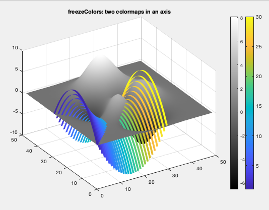

# freezeColors/unfreezeColors

freezeColors allows multiple colormaps to be used per figure and even within a single axis.

## History

In 2005 freezeColors was written to enable multiple colormaps in a single figure, something MATLAB could not do. 
It was a [file exchange pick of the week](https://blogs.mathworks.com/pick/2009/07/24/using-multiple-colormaps-in-a-single-figure/) in 2009.

In 2014, MATLAB enabled each axis to have its own colormap. However, freezeColors still had a following
because it was more flexible and enabled multiple colormaps _within a single axis_ as well. 

As MATLAB's graphics are continually evolving, over time freezeColors stopped working in some situations, such as with colorbars.
Now, in 2022, it's been brought back up to date and will hopefully work in every use people have in mind. If not,
let me know and I'll try to fix it.

2022 Changes (v. 2.5)

    * greater emphasis on multiple colormaps within a single axis
    * new method for freezing colorbars
    * scatter works properly
    * works properly when calling freezeColors(axesHandle)
    * includes a replacement for colorbar: jicolorbar

## Usage

    freezeColors            applies to all objects in current axis
    freezeColors(axh)       same, but works on objects in axis axh.
    freezeColors(colorbar)  creates a colorbar frozen to the current colormap

## Examples

### Multiple colormaps per figure (legacy)

    subplot(2,1,1); imagesc(peaks); colormap hot; freezeColors; freezeColors(colorbar)
    subplot(2,1,2); imagesc(peaks); colormap hsv; freezeColors; freezeColors(colorbar) %etc...

Note, in such a simple case, this could just as well use matlab's per-axis colormaps (2014 and later):

	subplot(2,1,1); imagesc(peaks); colorbar; colormap(gca,'hot')
	subplot(2,1,2); imagesc(peaks); colorbar; colormap(gca,'hsv')

Here is an example (from [test/test_main.m](https://github.com/jiversen/freezeColors/blob/master/test/test_main.m)) also 
showing one scatterplot panel using multiple colormaps in a single axis.

### Interesting: multiple colormaps in an axis

freezeColors can do something that some people need and not possible currently in MATLAB: having objects using multiple 
different colormaps within the same axis. These examples are somewhat contrived, but illustrate the possibilities.

    figure
	surf(peaks); colormap parula; freezeColors; freezeColors(jicolorbar); hold on
	surf(peaks+20); caxis([14 28]); colormap gray; freezeColors; freezeColors(colorbar);
	surf(peaks+40); caxis(caxis+20); colormap hot; freezeColors; freezeColors(jicolorbar('horiz'));
	axis auto; shading interp; caxis([14 28]); view([-27 14]); set(gca,'color',[.8 .8 .8])

Example with surf and ribbon

Example with streamribbon and coneplot

See [test/test_main.m](https://github.com/jiversen/freezeColors/blob/master/test/test_main.m) for more examples.

## How it works

The color of some graphic objects in MATLAB is controled by a CData property (surf, image, scatter, patch, coneplot, streamribbon, etc), which is usually converted to color using
the current colormap using a scaling process. Thus if the colormap changes, the appearance changes. `freezeColors` simply converts
all graphics objects from scaled CData to direct RGB CData meaning its appearance is 'frozen' to the current colormap and thus
subsequent changes to the colormap will not change its appearance. The original scaled data are stored and can be restored using `unfreezeColors`.

## Caveats

In its continued quest for improvement, some graphics objects change over time, foremost among them colorbars, which used to be
implemented as images and thus could easily be frozen along with other objects. Nowadays they are encapsulated in an opaque object and
we needed to find a new way to freeze them. Now simply call `freezeColors(colorbar)`
to add a 'frozen' colorbar to an axis. It will appear to unfreeze when you change colormaps, but the next call to freezeColors will
restore its frozen appearance. It will not be frozen to the caxis, so be aware of that. 
It's a workaround, but just remember to call `freezeColors` after you change the colormaps and
all will be well. This has the benefit of also freezing `contourf` plots, as long as you call `freezeColors(colorbar)` after the plot.

Also, having multiple colorbars in an axis is a work in progress--a combination of jicolorbar and colorbar were used in the examples
and required some attention to setting the caxis; a more sustainable solution would be a new version of jicolorbar that 
more easily enables multiple (frozen) colorbars per axis...